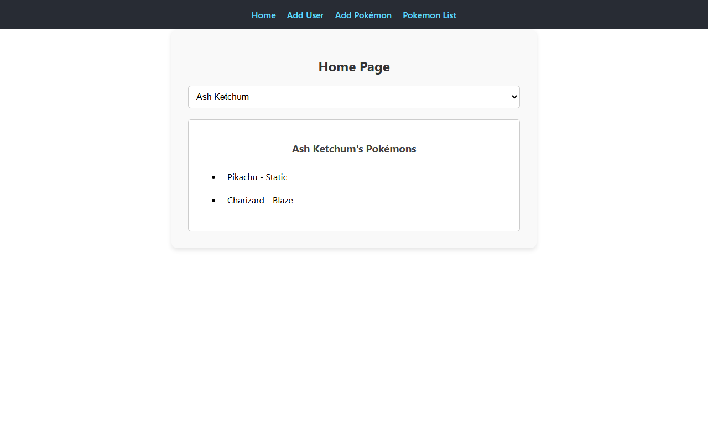
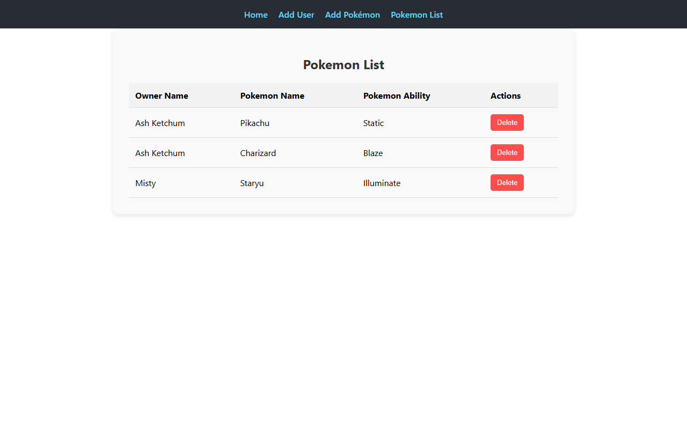
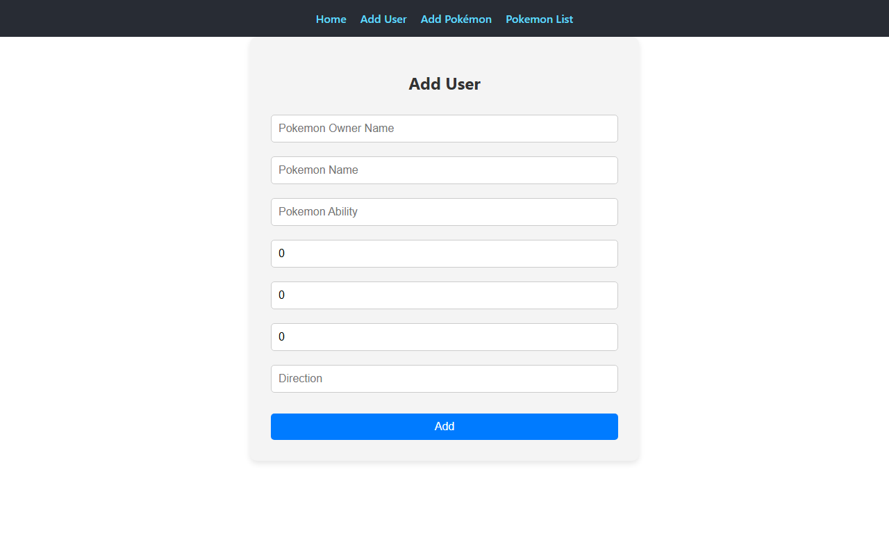
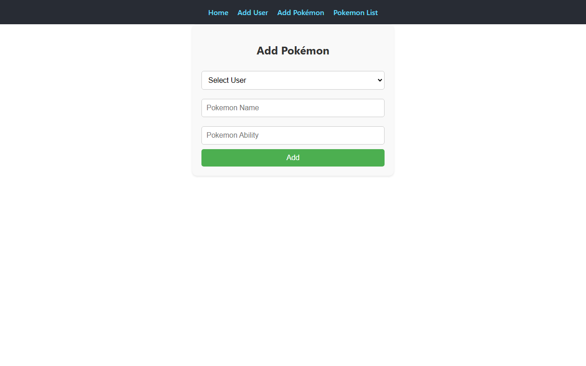

# Pokemon Tracker

A React app for tracking which Pokémon belong to which trainer — register trainers, assign them Pokémon, and browse the full roster.

## Overview

Pokemon Tracker is a small CRUD front end built with React and React Router. Trainers ("users") are registered with an initial Pokémon, more Pokémon can be added to existing trainers, and the full owner → Pokémon roster can be browsed or pruned from a table view.

The project ships with a minimal in-memory mock API (`/server`) so it runs end-to-end locally without any external service or database.

> **Note:** This was originally scaffolded as a frontend for a separate backend that was never published. The bundled `/server` mock API exists to make the app runnable and demonstrable; swap `REACT_APP_API_URL` for a real backend if you build one. See [Known Limitations](#known-limitations).

## Features

- Register a trainer with their first Pokémon (`/add-user`)
- Add additional Pokémon to an existing trainer (`/add-pokemon`)
- View a trainer's Pokémon roster on the home page (`/`)
- Browse every trainer/Pokémon pair in a table and delete trainers (`/pokemon-list`)
- Loading, empty, and error states on every data-fetching page

## Screenshots

| Home | Pokemon List |
|---|---|
|  |  |

| Add User | Add Pokémon |
|---|---|
|  |  |

## Technology Stack

- React 18, React Router 6
- Axios
- Create React App (`react-scripts` 5)
- Mock API: Express (in `/server`)

## Local Installation

Requires Node.js 18+.

```bash
git clone https://github.com/Rockstar100/pokemon-frontend.git
cd pokemon-frontend
npm install
```

### Environment variables

Copy `.env.example` to `.env` and adjust if needed:

```bash
cp .env.example .env
```

| Variable | Description | Default |
|---|---|---|
| `REACT_APP_API_URL` | Base URL of the API the app talks to | `http://localhost:5000` |

### Run it

You need two terminals — one for the mock API, one for the React app:

```bash
# Terminal 1 — mock API on :5000
npm run server

# Terminal 2 — React app on :3000
npm start
```

Open [http://localhost:3000](http://localhost:3000). The mock API seeds two sample trainers so the app has data to show immediately.

## Available Commands

| Command | Description |
|---|---|
| `npm start` | Run the React app in development mode |
| `npm run build` | Build the app for production into `/build` |
| `npm test` | Run the test suite |
| `npm run server` | Install and start the mock API on port 5000 |

## Project Structure

```
pokemon-frontend/
├── public/            # Static HTML, favicon, manifest
├── server/             # Minimal in-memory mock REST API
│   └── index.js
├── src/
│   ├── config.js       # Reads REACT_APP_API_URL
│   ├── pages/           # Home, AddUser, AddPokemon, PokemonList
│   ├── App.js           # Routes and navigation
│   └── index.js
└── .github/workflows/deploy.yml
```

## API Reference (mock server)

| Method | Route | Description |
|---|---|---|
| `GET` | `/users` | List all trainers and their Pokémon |
| `POST` | `/users` | Create a trainer (`{ pokemonOwnerName, pokemons: [...] }`) |
| `PUT` | `/users/:ownerName` | Replace a trainer's full record (used to append a Pokémon) |
| `DELETE` | `/users/:ownerName` | Delete a trainer |

Data is stored in memory and resets whenever the mock server restarts.

## Deployment

The app deploys to GitHub Pages via `.github/workflows/deploy.yml` on every push to `main`.

**Live demo:** https://Rockstar100.github.io/pokemon-frontend

Because the deployed site is static, it has no backend to talk to — the hosted demo shows the UI shell with empty states (no trainers, no seed data) rather than working CRUD. Run it locally with the mock API (above) to see it fully functional.

## Known Limitations

- No real backend exists for this project; the included `/server` is a mock for local development/demo purposes, not a production API. Data isn't persisted anywhere and resets on restart.
- The GitHub Pages live demo cannot reach the mock API (it only runs locally), so it renders empty states rather than live data.
- No authentication — anyone can add/delete trainers.
- `react-scripts` requires `DISABLE_ESLINT_PLUGIN=true` to build in this environment due to an ESLint version conflict inside `eslint-config-react-app`; this is set automatically in the deploy workflow.

## Future Improvements

- Replace the mock API with a real backend and a persistent database.
- Add form validation and duplicate-trainer checks.
- Add authentication so rosters are scoped per user.

## License

MIT — see [LICENSE](LICENSE).

## Author

**Parveen Jaiswal**
GitHub: [@Rockstar100](https://github.com/Rockstar100)
